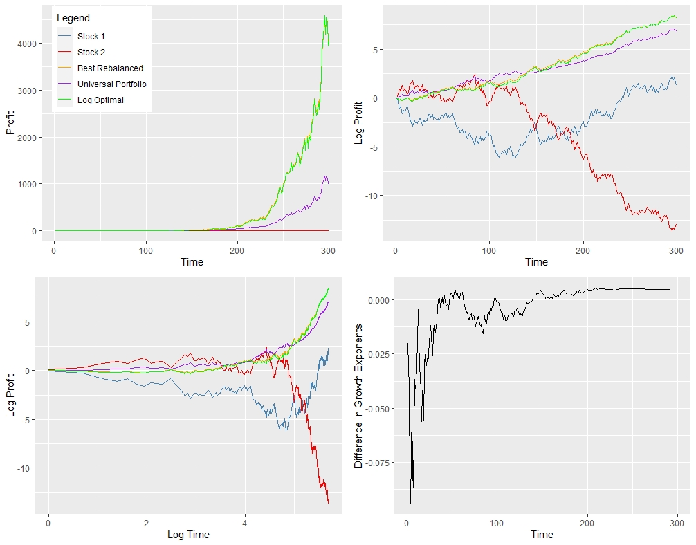

## MU Weighted Universal Portfolio Algorithm
🔄 Universal Portfolio Simulation  
This project implements and simulates the Universal Portfolio strategy, a discrete time, model-free, portfolio selection method proposed by Thomas M. Cover. Unlike traditional strategies that rely on return prediction or optimization assumptions, the universal portfolio adapts to market behavior and asymptotically matches the performance of the best constant-rebalanced portfolio (CRP) in hindsight. This is a performance weighted algorithm which 

📘 What is a Universal Portfolio?  
Universal Portfolio's are a family of mathematical algorthims which asymptotically obtain the same growth exponent, to first order, as the best constantly rebalanced portfolio in hindsite. In this project we focus on the so called MU weighted Universal Portfolio. The algorithm distributes wealth over all possible portfolios, with respect to a given measure MU, and continuously rebalances towards those that perform better on the oberseved stock data. For a discrete time T, portfolios which have a strong perforomance on data up until T-1 are given more weight in the construction of the portfolio for time T. The Universal Portfolio is therefore a performance weighted algorithm. 

Key idea:  

"Without assuming any statistical model, we can still construct a portfolio strategy that is nearly as good as the best fixed portfolio in hindsight."

🧠 Core Concepts
Online Learning: Updates portfolio allocations using past observed returns, without forecasting.

No Model Assumptions: Makes no assumptions on asset return distributions. The only assumption is that the 

Performance Guarantee: Achieves the same asymptotic growth rate as the best constantly rebalanced portfolio in hindsite. 

📖 References
Cover, T. M. (1991). Universal Portfolios. Mathematical Finance, 1(1), 1–29.

Universal Portfolios - Wikipedia
