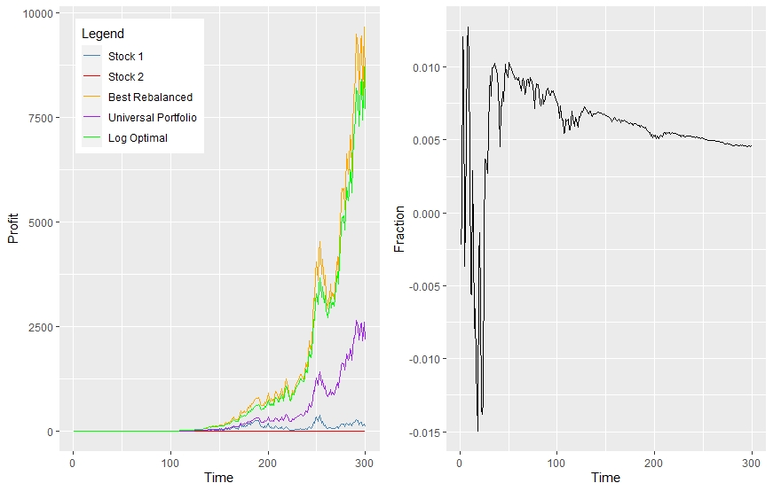
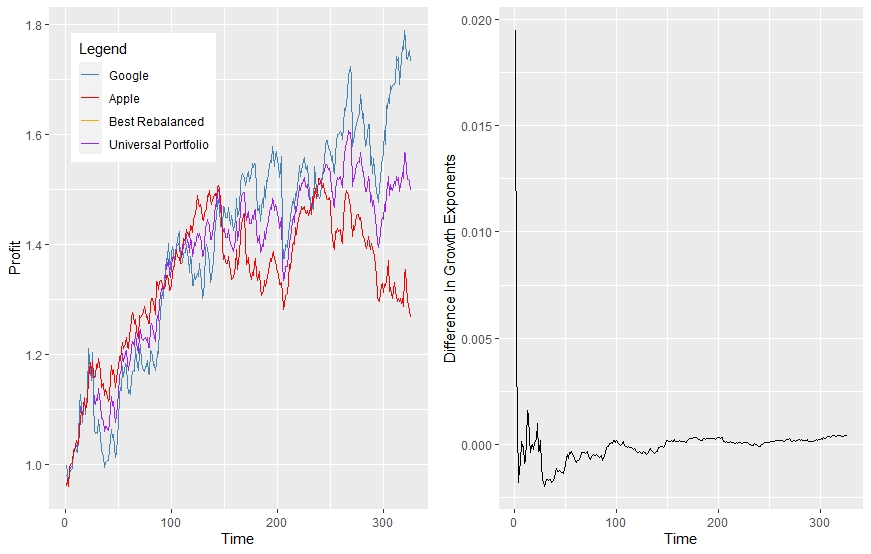

## Universal Portfolio Algorithm
🔄 Universal Portfolio Simulation  
This project implements and simulates the Universal Portfolio strategy, a discrete time, model-free, portfolio selection method proposed by Thomas M. Cover. Unlike traditional strategies that rely on return prediction or optimization assumptions, the universal portfolio adapts to market behavior and asymptotically matches the performance of the best constant-rebalanced portfolio (CRP) in hindsight. This is a performance weighted causual algorithm which does not rely on external data. 

📘 What is a Universal Portfolio?  
Universal Portfolio's are a family of mathematical algorithms which asymptotically obtain the same growth exponent, to first order, as the best constantly rebalanced portfolio in hindsite. In this project we focus on the so called MU weighted Universal Portfolio. The algorithm distributes wealth over all possible portfolios, with respect to a given measure MU, and continuously rebalances towards those that perform better on the oberseved stock data. For a discrete time T, portfolios which have a strong perforomance on data up until T-1 are given more weight in the construction of the portfolio for time T. The Universal Portfolio is therefore a performance weighted algorithm. 

Key idea:  
"Without assuming any statistical model, we can still construct a portfolio strategy that is nearly as good as the best fixed portfolio in hindsight."

🧠 Core Concepts  
Causal Construction: Updates portfolio allocations using past returns only, with no requirment for forcasting. 

No Model Assumptions: Makes no assumptions on asset return distributions. The only assumption is that the stock prices remain bounded, a reasonable model assumption.

Performance Guarantee: Achieves the same asymptotic growth rate as the best constantly rebalanced portfolio in hindsite. <dr>

## Simulations
The first-right image demonstartes a number of bench mark investment stratagies for m = 2 stocks generated randomly according to a Dirichlet distribution, (x_1,...x_n), with n = 300 discrete time points. The x-axis shows time and the y-axis shows the factor of return. We plot the investment soley in stocks 1 and 2, the Universal Portfolio and the best hindsite portfolio. From this we observe that the universal portfolio achieves a growth exponent similar to that of the best hindsite portfolio. The first-left image demonstrates the difference in growth exponent between these two strategies, W_1 - W_2, tending to 0 for large n. To summarise, the universal portfolio performs significantly better than investment in either stock, obtaining over 2500×
the initial investment in only 300 trading days; quite remarkable for a causal portfolio!

The second image shows the same Universal Portfolio algorithm applied to GOOG and AAPL stock data from 2023. As expected, the best rebalanced portfolio invests its wealth into the stock with the highest return. The universal portfolio edges its bets between the two, but gradually upweights the stronger asset. As the theory suggests, the second-left image demonstrates the difference in growth exponent tending to 0. 

📖 References
Cover, T. M. (1991). Universal Portfolios. Mathematical Finance, 1(1), 1–29.

